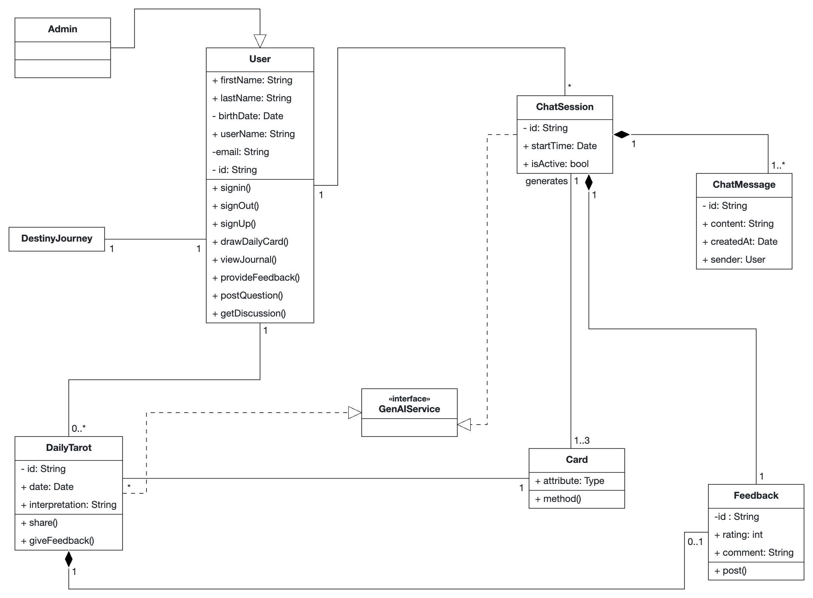
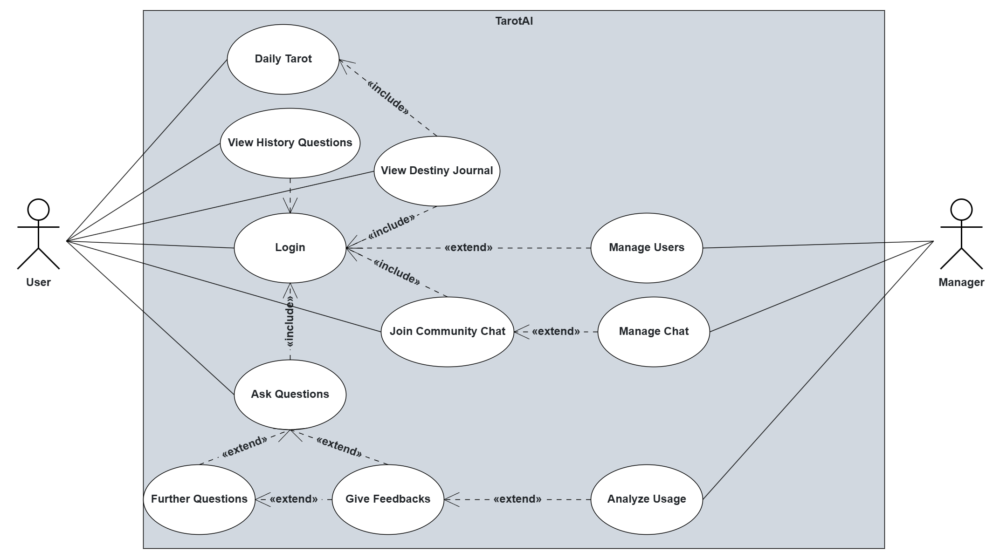

Website: https://team-divops-devops25.student.k8s.aet.cit.tum.de

Genai API: https://team-divops-devops25.student.k8s.aet.cit.tum.de/genai/health

# TarotAI: AI-Powered Tarot Furtune Teller

Many users seek guidance or emotional insight through tarot readings, but traditional tarot apps often feel rigid, overly mechanical, or too abstract. Our app aims to bridge the mystical elements of tarot with the conversational power of Generative AI, offering a personalized, emotionally resonant experience.

---

### 🎯 What is the Main Functionality?

- **Daily Tarot**: Personalized daily reading tailored to your past patterns.
- **Natural Language Tarot Reading**: Users ask questions in their own words; the system responds with relevant card readings powered by GenAI.
- **AI-Enhanced Interpretation**: Each card drawn is accompanied by a rich narrative-style explanation, tone-adapted to the user's question.
- **User Feedback Adaptation**: The app continuously learns from feedback to refine keyword associations in the vector database.

---

### 👥 Who Are the Intended Users?

- Individuals interested in tarot, astrology, or spiritual insight
- Casual users seeking a fun, gamified introspective tool
- Wellness app users who seek mental clarity or journaling prompts

---

### 📖 Example Scenarios

#### 🔮 Scenario 1: Casual Daily Use
- **User**: Click the "Daily Tarot" button.
- **App**: Draws 3 cards, gives a narrative: "Today are The Magician... A chance awaits you to use your full potential..."

#### 💔 Scenario 2: Emotional Decision
- **User**: "Should I give them another chance?"
- **App**: Draw 3 cards, explains with AI-generated empathy: "Your heart seeks clarity, but the signs hint toward imbalance..."

#### 📈 Scenario 3: Data-Driven Learning
- **User**: Rates the reading from 0 to 5 stars (e.g., 0 = not accurate, 5 = very accurate).
- **App**: If the user gives a rating of 4 or 5, the feedback and context are logged and added to the RAG system to enhance future retrieval and improve answer relevance for similar questions.

---

## System Overview
### Class Diagram


### Use Case Diagram


### Component Diagram


---

## Prerequisites
- Docker and Docker Compose
- Git

---

## Quick Start

```
# 1. Clone the repository
git clone git@github.com:AET-DevOps25/team-divops.git && cd team-divops

# 2. Start all services
docker-compose up -d

# 3. Verify deployment
curl -s https://team-divops-devops25.student.k8s.aet.cit.tum.de
```

---

## API Documentation

Backend SwaggerUI: https://team-divops-devops25.student.k8s.aet.cit.tum.de
GenAI SwaggerUI: https://team-divops-devops25.student.k8s.aet.cit.tum.de

There are also detailed docs for GenAI API under ```/genai``` file.

---

## Monitoring

---

## Deployment
### Rancher

### AWS

---


